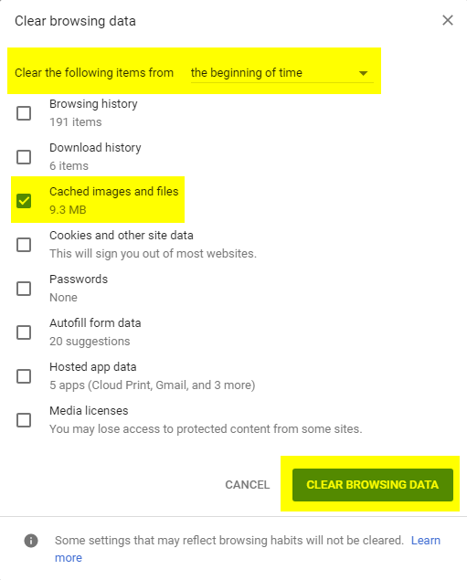
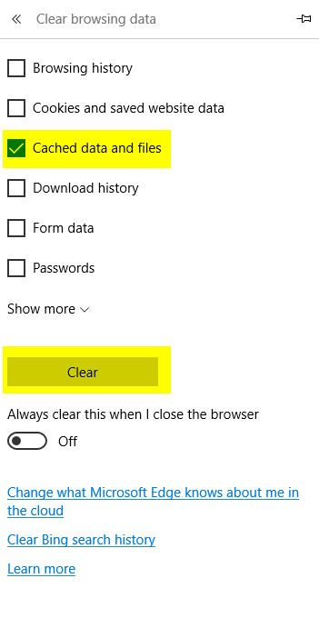
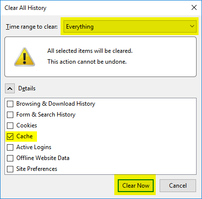

Clearing your browser cache
===========================

For IE, Edge, Chrome, and Firefox, the first step is the same: Press Ctrl + Shift + Delete to bring up the browsers cache management dialog. Each browser will have a different name for this dialog.

Internet Explorer
-----------------

1. Check the *Temporary Internet files and website files* checkbox
2. Click the *Delete* button.

Chrome
------

1. Set the *Clear the following items from* option to *the beginning of time*
2. Check the *Cached images and files* checkbox.
3. Click the *Clear Browsing Data* button.

Edge
----

1. Check the *Cached data and files* checkbox.
2. Click the *Clear* button.

Firefox
-------

1. Select *Everything* from the *Time range to clear* drop-down.
2. Check the *Cache* checkbox in the *Details* section.
3. Click the *Clear Now* button.

