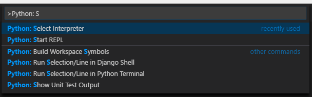
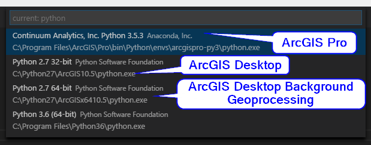

Python Development
==================

**This guide is currently a work-in-progress.**

Python is mainly used at WSDOT in association with ArcGIS software.

Using multiple Python environments
----------------------------------

The various different ArcGIS software products each use their own specific versions of Python.

* Python 2.X
    * 32-bit
        * ArcGIS Desktop
    * 64-bit
        * ArcGIS Desktop ([Background Geoprocessing])
        * ArcGIS Server
* Python 3.X (64-bit)
    * ArcGIS Pro

Once you have completed the setup steps in the *Setup* section below, you can use the [Python Launcher for Windows] to choose between the different Python 2.X versions associated with the non-Pro ArcGIS software and use [propy.bat] to use the Python 3 environment that is installed with ArcGIS Pro.

### Setup ###

1. Install the ArcGIS software you want to use.
2. Install the latest version of Python 3 (64-bit) [**using an installer downloaded from python.org**](https://www.python.org/downloads/windows/). Only the installers from the official python.org site seem to include the [Python Launcher for Windows], which you will need to launch the various versions of Python. (Note that you can change these options after installation using the *Add / Remove Programs* control in Windows using the Modify option with Python.)
    1. Run the installer file.
    2. Check the *Install launcher for all users* checkbox.
    3. Check the *Add Python 3.X to PATH* checkbox. (The *X* will actually be a version number.)
    4. Click the *Customize Installation* button (rather than *Install Now*).
    5. Make sure the *py lancher* and *for all users* option, then click the *Next* button.
    6. Make sure the following options are checked:
        * Install for all users
        * Associate files with Python (requires the py launcher)
        * Create shortcuts for installed applications
        * Add Python to environment variables
    7. Click the install button.
3. Add the following folder to your system's PATH variable (assuming ArcGIS Pro's default install location): `C:\Program Files\ArcGIS\Pro\bin\Python\Scripts`. Make sure this folder is listed **after** the two folders that were added to the `PATH` by the Python 3 installer from python.org. This step allows you to use the ArcGIS Pro Python environment by using `propy.bat`.


Recommendations
---------------

* Write Python code to work with both Python 2.x and Python 3.x by [following these guidelines][Porting Python 2 Code to Python 3].
* Use [argparse] module when creating command-line tools. If your module contains a script called `__main__.py` then it can be run from the console using `python -m`.
* Document function parameter and return types using [`# type:` comments][Suggested syntax for Python 2.7 and straddling code].
* Include the following line to force Python 2.x to behave like Python 3.x.
    ```python
    from __future__ import absolute_import, division, print_function, unicode_literals
    ```

Recommended Tools
-----------------

### [Visual Studio Code] ###

#### Helpful extensions ####

* [Python Extension]
* [gitignore extension] - Used for easily creating a `.gitignore` file for Python development.

#### Selecting an environment ####

1. Press either *F1* or *Ctrl + P* to bring up the Command Palette (or select *Command Palette...* from the *View* menu)
2. Begin typing `Python: Select Interpreter` and select that option from the drop down when it becomes visible.
3. Select one of the environments that contains the text "ArcGIS" in its path.




### Tools installed as Python packages ###

These tools can be installed via [pip]. Alternatively, some can also be installed via [Conda].

* [pylint]
* [autopep8]

Starting a new project
----------------------

1. Create a new folder.
2. Open the folder in Visual Studio Code.
3. From the Command Pallette, select *Add gitignore* and then *Python* to generate a new `.gitignore` file.
4. Set up the folder structure described in *[Extending geoprocessing through Python modules]*.

Pylint configuration
--------------------

Pylint will not recognize some arcpy classes or properties and you will need to modify the `generated-members` section of your `.pylintrc` file. ([Examples][generated members example])

Links
-----

* [WSDOT Python projects on GitHub]
* [Extending geoprocessing through Python modules]
* [Python Packaging User Guide]

[argparse]:https://docs.python.org/3/library/argparse.html
[autopep8]:https://pypi.io/project/autopep8/
[Background Geoprocessing]:https://desktop.arcgis.com/en/arcmap/latest/analyze/executing-tools/64bit-background.htm
[Conda]:http://pro.arcgis.com/en/pro-app/arcpy/get-started/using-conda-with-arcgis-pro.htm
[Extending geoprocessing through Python modules]:https://pro.arcgis.com/en/pro-app/arcpy/geoprocessing_and_python/extending-geoprocessing-through-python-modules.htm
[generated members example]:https://github.com/search?utf8=%E2%9C%93&q=org%3AWSDOT-GIS+filename%3A.pylintrc+generated-members&type=Code
[gitignore extension]:https://marketplace.visualstudio.com/items?itemName=codezombiech.gitignore
[PEP 484]:https://www.python.org/dev/peps/pep-0484/
[pip]:https://pip.pypa.io/
[Porting Python 2 Code to Python 3]:https://docs.python.org/3/howto/pyporting.html
[propy.bat]:https://pro.arcgis.com/en/pro-app/arcpy/get-started/using-conda-with-arcgis-pro.htm
[pylint]:https://pypi.io/project/pylint/
[Python Extension]:https://marketplace.visualstudio.com/items?itemName=donjayamanne.python
[Python Launcher for Windows]:https://docs.python.org/3/using/windows.html#python-launcher-for-windows
[Python Packaging User Guide]:https://packaging.python.org/
[Suggested syntax for Python 2.7 and straddling code]:https://www.python.org/dev/peps/pep-0484/#suggested-syntax-for-python-2-7-and-straddling-code
[Visual Studio Code]:https://code.visualstudio.com/
[WSDOT Python projects on GitHub]:https://github.com/WSDOT-GIS?utf8=%E2%9C%93&q=&type=&language=python
